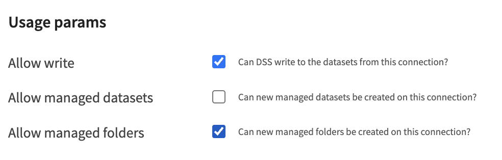
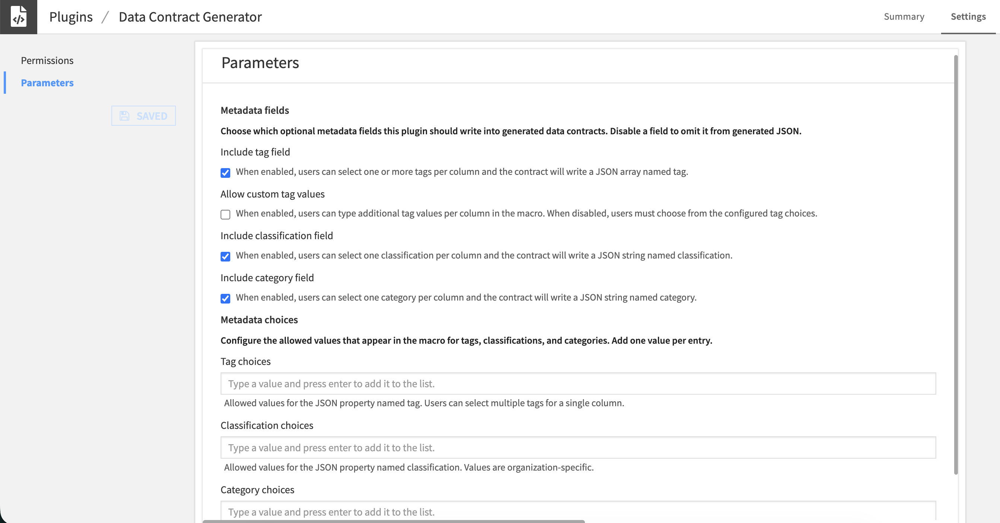
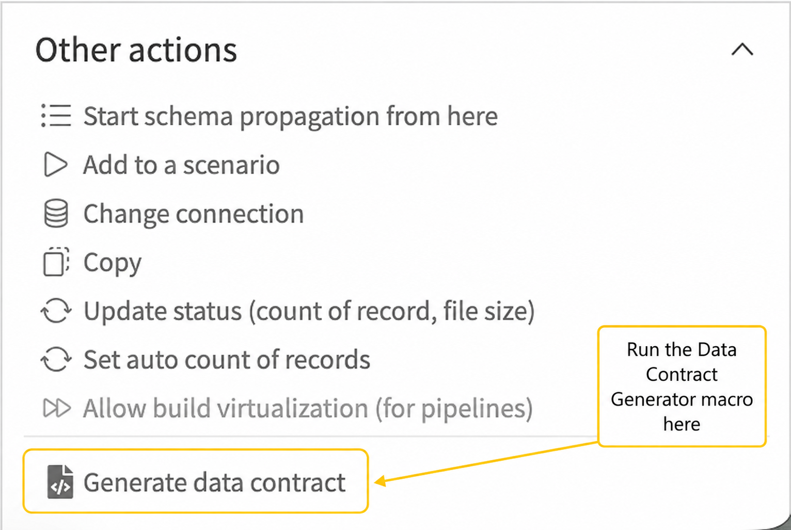
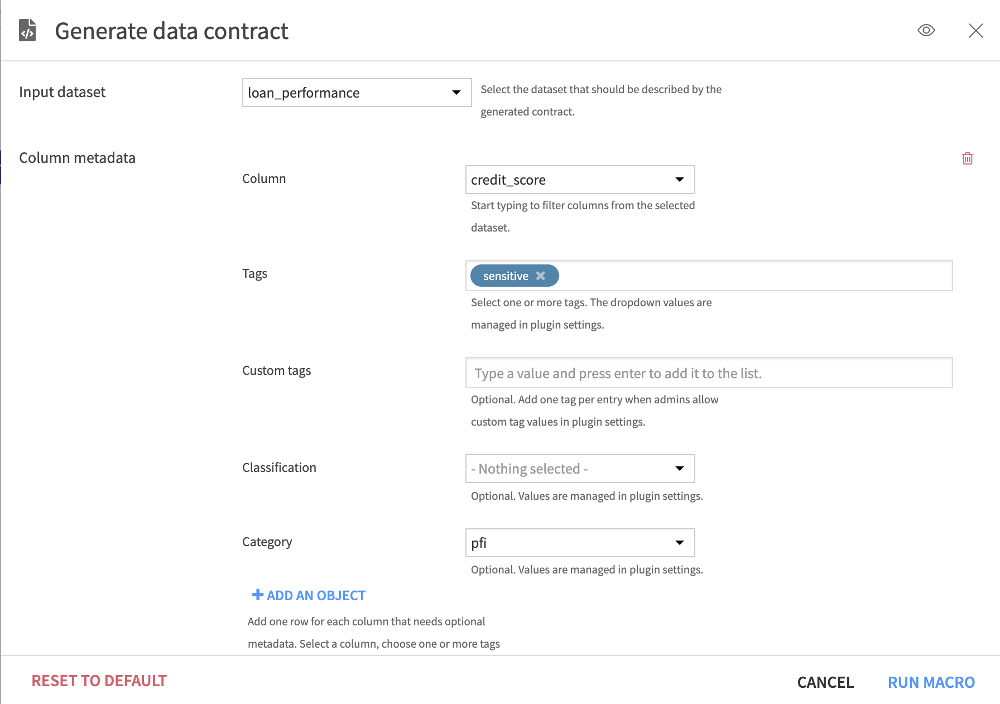

# Dataiku Data Contract Generator

Generate standardized JSON data contracts directly from Dataiku datasets.

This plugin automatically extracts dataset schema, metadata, and governance information to create machine-readable JSON data contracts that can be shared across teams and integrated into governance workflows.

---

## Why?

One of the biggest challenges in modern data platforms is that datasets rarely come with clear ownership, expectations, or documentation.

Data contracts help solve this by creating a shared agreement between data producers and consumers.

This plugin automates much of that process by generating standardized contracts directly from your Dataiku projects.

---

## Features

- Automatically extracts dataset schema
- Captures table and column descriptions
- Generates standardized JSON data contracts
- Supports optional column-level tags
- Supports optional classifications and governance categories
- Allows administrators to configure metadata values
- Optionally allows users to enter custom tag values
- Infers numeric precision (`multipleOf`) where possible
- Creates managed folder automatically

---

## Installation

Download this repository as a zip file and upload it in your Dataiku instance under Administration & Settings -> Plugins.

## Plugin Configuration

Before using the **Data Contract Generator** macro, configure where generated contracts should be stored and which optional metadata fields your organization wants to support.

### Managed Folder Filesystem

The macro writes generated contracts to a project managed folder named `data_contracts`.

Before running the macro, make sure an admin does one of the following:

1. Create a managed folder in the project named `data_contracts`, or
2. Make sure the connection selected in the plugin settings allows new managed folders to be created.

To allow the macro to create the folder automatically, a Dataiku administrator should enable managed folder creation on the selected connection.

<p align="center">
  
</p>

The setting is found in the Admin Settings -> Connections under the connection’s "Usage Params".

If **Allow managed folders** is not enabled for the selected connection, the macro will not be able to create the `data_contracts` folder automatically. In that case, create the managed folder manually or choose another connection that supports managed folder creation.

### Metadata Options

The plugin can optionally include column-level metadata in the generated data contract. Use the plugin settings to choose which metadata fields your organization wants to support:

- **Tags**
- **Classifications**
- **Categories**

If a metadata type is enabled, it will appear in the macro screen when users generate a data contract. If it is disabled, that field will be hidden from the macro and omitted from the generated JSON.



### Tags

Add the tag values that users should be able to select for columns when generating data contracts. Tags are written to the contract as an array, so users can select multiple tags for a single column.

Enable **Allow custom tag values** if users should be able to type their own tag values in addition to selecting from the configured list. Leave this unchecked if users should only use the approved tag values configured by the plugin administrator.

### Classifications

Add the classification values that users should be able to select for columns. Classifications are single-select per column.

Enable classifications only if your organization uses a formal classification taxonomy. If classifications are not needed, disable this option and the generated contract will omit the `classification` field.

### Categories

Add the category values that users should be able to select for columns. Categories are single-select per column.

Enable categories only if your organization groups sensitive or governed data into categories. If categories are not needed, disable this option and the generated contract will omit the `category` field.

### Recommended Setup

At a minimum, select the filesystem for the managed folder and decide which metadata fields should be available to users. Then add the approved values for any enabled metadata fields. This ensures users can generate consistent data contracts while still allowing each organization to use its own terminology. It is recommended to allow managed folder creation on your filesystem connection, otherwise an admin will have to manually create the managed folder in each project.

---

## Generate a Data Contract

After the plugin is configured, select the dataset you want to document and run the **Generate Data Contract** macro, located under "Other Actions".
<p align="center">
  
</p>

In the macro screen:

1. The selected dataset is prepopulated but you can change it to a different one.
2. Add one row for each column that needs additional metadata.
3. Select the column.
4. Choose one or more tags, if tags are enabled.
5. Choose a classification, if classifications are enabled.
6. Choose a category, if categories are enabled.
7. Run the macro.

The plugin will generate a JSON data contract and save it to the project’s `data_contracts` managed folder.



---

## Example Contract

```json
{
  "name": "customer_transactions",
  "description": "Customer transaction history used for fraud detection.",

  "properties": {
    "transaction_id": {
      "order": 1,
      "type": "string",
      "title": "transaction_id",
      "description": "Unique transaction identifier"
    },
    "customer_id": {
      "order": 2,
      "type": "string",
      "title": "customer_id",
      "description": "Unique customer identifier",
      "tag": "sensitive",
      "category": "PII"
    },
    "amount": {
      "order": 3,
      "type": "number",
      "title": "amount",
      "description": "Transaction amount",
      "multipleOf": 0.01
    }
  }
}
```

---

## Output

Contracts are written as

```
<dataset_name>_data_contract.json
```

inside a Dataiku managed folder

```
data_contracts/
```

---

## Compatibility

- Developed for DSS 12.7, tested and compatible through 14.7

---

## Roadmap

- YAML contract support

---

## Blog Series

This project accompanies my blog series on data contracts.

- Part 1 – [The Case for Data Contracts](https://medium.com/@julhofmeister/the-case-for-data-contracts-e2c2af6ee2e1) 
- Part 2 – Operationalizing Data Contracts with Dataiku *(coming soon)*

---

## Contributing

Contributions are welcome. Please open an issue or pull request if you find a bug or want to improve the plugin.

---

## License

Apache 2.0

---

## Disclaimer

This is an independent open-source project built using the Dataiku plugin framework and is not an officially supported Dataiku product. For issues, please open a pull request or contact julia.hofmeister@dataiku.com.
