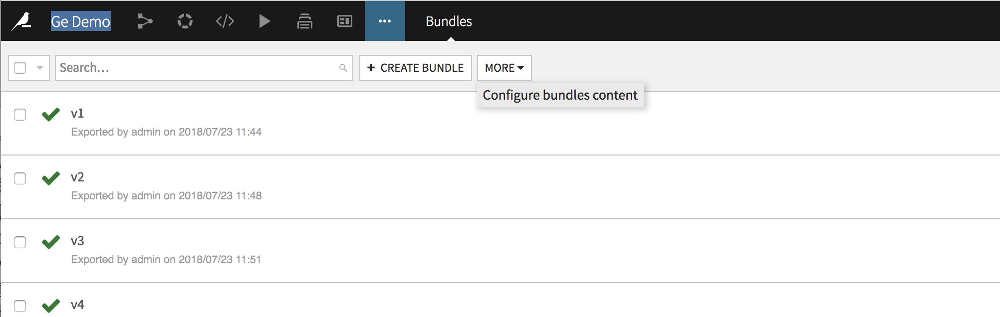
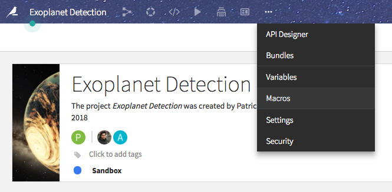
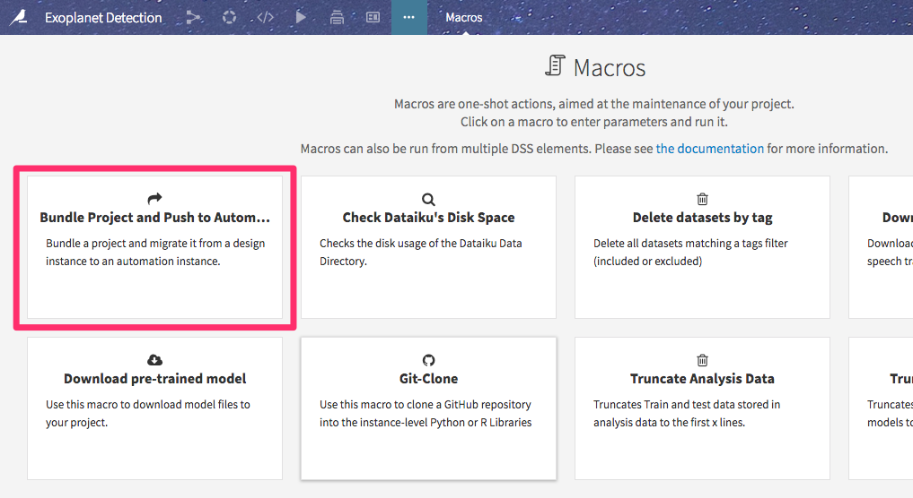
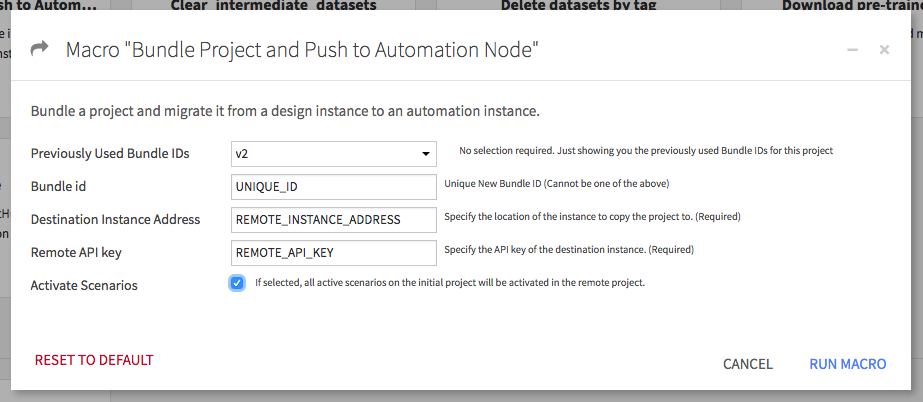

# Dataiku Bundle Project and Push to Automation Node Plugin

Current Version: 0.0.2

Status:  **experimental**  

## Overview

This bundles a project and imports it onto another Dataiku automation or design instance.

Use this macro to push projects from one DSS node to another without having to download a zip file of the project locally. It can be used in a production setting to go from design -> automation node or just to copy over projects between design nodes.

## Before Running this Plugin

1. Make sure that any external connections used in the initial project also exist on the remote node instance. These connections must have the same names, but do not have to point to the same paths.

2. If you use any datasets from the server filesystem or that you uploaded manually, you must manually "attach" these datasets to all bundles (just once, not each time you create a bundle).

To do this, click on the "Bundles" tab of the project, then "More", then "Configure Bundles Content".

Add all uploaded files, server_filesystem files, and deployed models using the +Add button.

3. Create a Global API key on the target remote instance, which should be used as an input for this macro.

## Instructions

1. Navigate to the project you'd like to bundle. Then click on "Macros" from the top menu.

2. Find the Bundle Project and Push to Automation Node macro.

3. Configure your settings. The "Previously Used Bundle IDs" list tells you which bundle IDs you have used in the past. The new Bundle ID chosen here cannot be a repeat of one of these. Enter the remote DSS instance address and API key. Select "Activate Scenarios" if you'd like to keep all active scenarios from the initial project as active in the remote project.

4. Once the macro finishes running, you'll see a list of plugins which are installed in the initial instance, but not installed in the remote instance. Check your project on the initial instance to see if it uses any of these plugins. If so, install them on the remote instance.

5. In this same box, you will see messages saying "Successfully created bundle" and "Bundle Activated" if the macro ran successfully.
