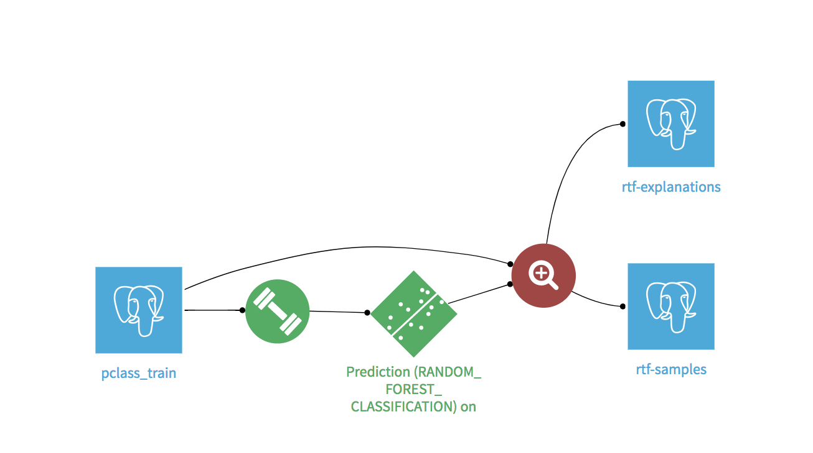
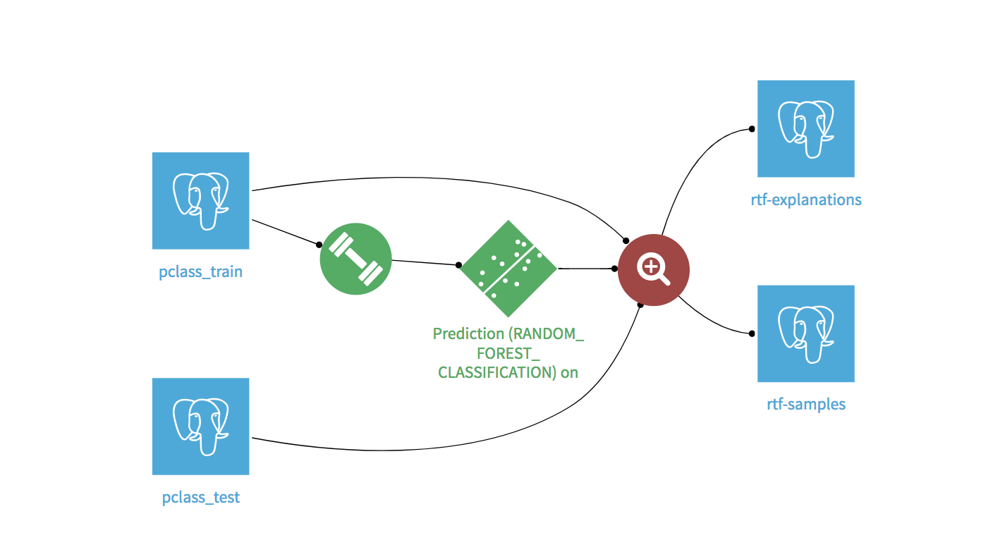
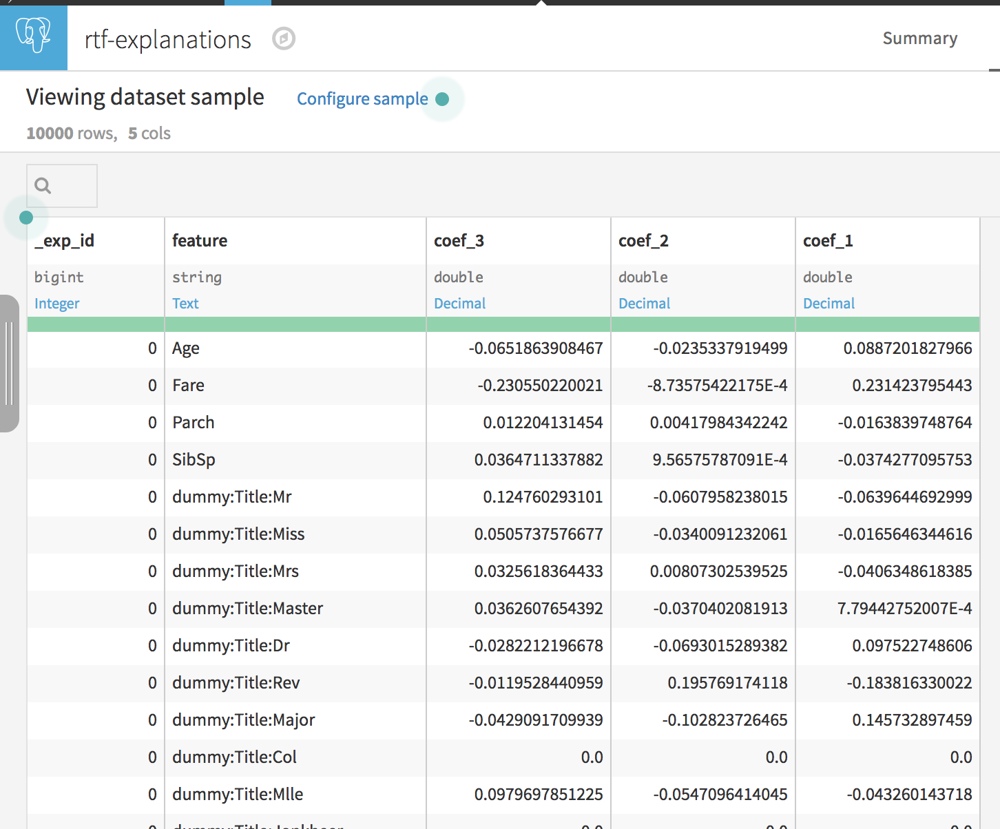
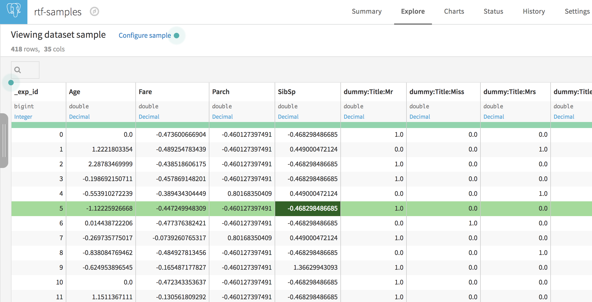

# Dataiku Lime Plugin

Current Version: 0.0.5

Status:  **experimental**

## Overview

This provides an implementation for the LIME model-agnostic interpretation technique described in ["Why Should I Trust You?": Explaining the
Predictions of Any Classifier](https://arxiv.org/abs/1602.04938)

## Install

* Checkout this directory from github
* In the lime plugin directory run `make plugin`
* The plugin will be accessible in the created `./dist`directory as a `.zip` file
* As DSS admin install the plugin following according to [dataiku documentation](https://doc.dataiku.com/dss/latest/plugins/offline_install.html)

## Usage

The plugin provides a simple `Classifaction Explain` recipe that will become available to users in the flow once the plugin is installed

* [INPUT] Train dataset

This is the train dataset used to train the model. LIME uses it to perform statistical computations that generates perturbations

* [INPUT] Saved model (Mandatory)

The model deployed in the flow

* [INPUT] Test (or to-explain) dataset _(Optional)_

If left empty, the recipe will explain the instances in the train dataset

Otherwise it will explain the instances in the to-explain dataset provided

* [OUTPUT] Explanations

Will contain the actual explanation for each instance in tabular format

* [OUTPUT] Detailed samples

Will contain the actual instance that was explain after model preprocessing and additional metrics like the local interpolation r2 score and average distance to the perturbations

Useful for debugging or refining model preprocessing design

## Limitations

* Works only on tabular data with NUMERIC or CATEGORICAL input features
* DSS Stream (in-memory) processing only
* Simple Ridge Regression for local interpolation with exponential kernel to weight distances to local perturbations
