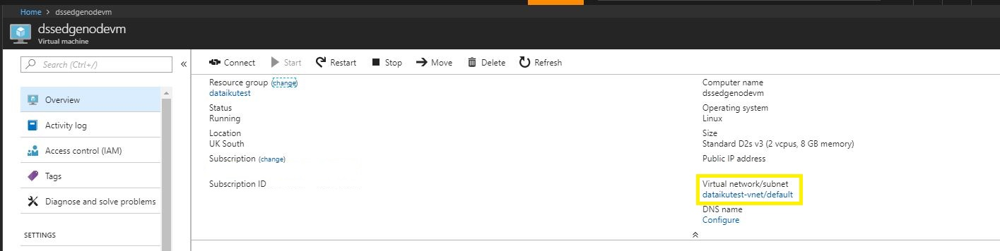
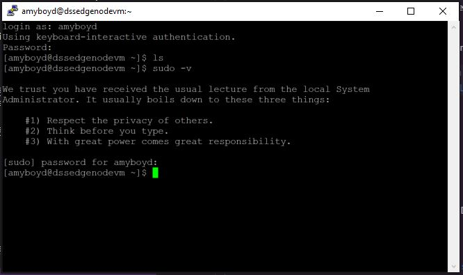
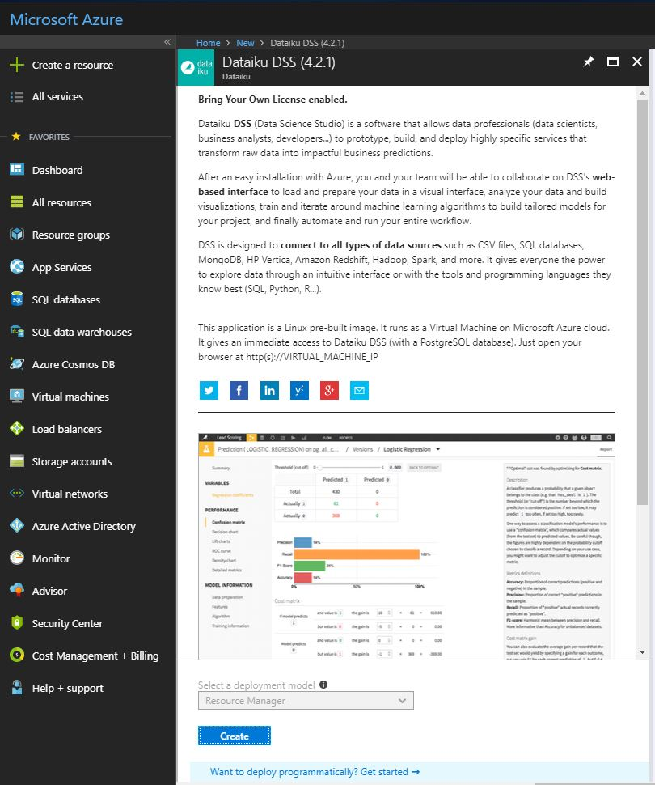

# Workaround for attaching a non-managed HDInsight edge node with Dataiku DSS to a standard HDInsight Spark cluster

> *Disclamer: This contribution is not subject to official support from Dataiku nor Microsoft and does not guarantee compatibility with future versions of HDI*

## Introduction

[Azure HDInsight](https://azure.microsoft.com/en-us/services/hdinsight/) is the industry leading fully-managed cloud Apache Hadoop & Spark offering which allows customers to do reliable open source analytics with an industry-leading SLA. [Dataiku](https://www.dataiku.com/) develops Data Science Studio (DSS), a collaborative data science platform that enables companies to build and deliver their analytical solutions more efficiently.

This combined offering of DSS on HDInsight(HDI) enables customers to easily use data science to build big data solutions and run them at enterprise grade and scale.

Attaching a non-managed edge node to a running HDInsight(HDI) cluster is not a feature supported by Azure HDInsight.
Standard deployment types include provisioning an application (in this case Dataiku Data Science Studio) as part of the cluster (managed edge node) or provisioning Dataiku DSS directly on the HDI headnode.
In both cases there is a drawback that the DSS instance will go down when the HDI cluster is removed while a typical use case will consist of persisting the VM where the application runs while spanning temporary HDI clusters

In this article we provide a workaround and helper script that can be used and adapted to perform HDI edge node configuration on an existing VM that will allow submitting jobs to temporary HDI cluster resource while persisting the application.

## Use case

Dataiku DSS already runs on a standalone Azure Ubuntu VM and you need to fire up a HDI cluster to perform Spark computation

## Caveats

Changes in HDI engineering are likely to break the solution. Additionally it is strongly advise to adapt the solution and script to your actual need and architecture specificities

## Limitations

  -	Ubuntu Azure VM 16.04 or 17.10
  -	Same VNET for HDI cluster and Dataiku DSS VM
  -	Matching HDP repository versions
  -	Password-less SSH key deployed with sudo permissions on HDI head node
  -	HDI  v3.5 and v3.6 non-secured Spark clusters with Spark 2.x

## <a name="prerequisites"> Prerequisites </a>

1. Verify that Dataiku DSS is up and running on an Ubuntu 16.04 or 17.10 Azure Virtual Machine

2. Retrieve the name of the Virtual Network the Azure VM is attached to _(it will be necessary at HDI cluster provisioning)_. You can find this in the Azure Portal


3. Ensure you have sudo permissions on the Virtual Machine. To check you can use ```sudo -v```


> If you do not have a running DSS on an Ubuntu VM, you can [create an new Azure Ubuntu VM](https://docs.microsoft.com/en-us/azure/virtual-machines/linux/quick-create-portal) and install the latest Dataiku DSS release following the [Dataiku DSS Linux Installation](https://doc.dataiku.com/dss/latest/installation/new_instance.html#complete-installation-example) procedure or use the [Dataiku Azure Marketplace pre-built image](https://azuremarketplace.microsoft.com/en-us/marketplace/apps/dataiku.dataiku-data-science-studio).


## Attachment Procedure

### Overview

- Prepare the DSS VM environment
- Install basic packages
- Copy HDI configuration and libraries from HDI headnode to DSS VM
- Test that job submission is running
- Re-Run install Hadoop integration on DSS

Those steps can be run either [manually](#attach-manually) or within a [shell script](#attach-with-shell-script) as detailed below

### <a name="attach-manually"> Attach Manually </a>

#### 1. Initial setup:

  - copy the HDP repo file from the cluster headnode ```/etc/apt/sources.list.d/HDP.list``` to the Dataiku DSS Ubuntu VM at ```/etc/apt/sources.list.d/HDP.list```

> you must have sudo permissions

  - install APT keys for Hortonworks and Microsoft
  ```Shell
  apt-key adv --keyserver keyserver.ubuntu.com --recv-keys 07513CAD 417A0893
  ```

  - install Java and Hadoop client packages on the edge VM:
  ```Shell
  apt-get update
  apt-get install \
  	openjdk-8-jdk hadoop-client hive hive2 pig tez tez-hive2-\* \
  	spark spark-python spark2 spark2-python hadooplzo hadooplzo-native libsnappy1 liblzo2-2
  ```

  - remove the initial set of Hadoop configuration directories
  ```Shell
  rm -rf /etc/{hadoop,hive*,pig,spark*,tez*,zookeeper}/conf
  ```

  - create a ssh keypair for the root account

  - create a directory used by the HDInsight Spark config
  ```Shell
  mkdir -p /var/log/sparkapp && chmod 777 /var/log/sparkapp
  ```
  - define the following environment variables (/etc/environment, or DSS_HOMEDIR/.profile)
  ```Shell
	export AZURE_SPARK=1
	export SPARK_MAJOR_VERSION=2
	export PYSPARK_DRIVER_PYTHON=/usr/bin/python
  ```

#### 2. Cluster association:

  - install the edge node ssh key on the head node

> can be a non-privileged account on the headnode side

  - copy the /etc/hosts definition for "headnodehost" from the head node to the edge node
  - flush ssh key cache for headnodehost

  ```Shell
  ssh-keygen -R headnodehost
  ```

  - synchronize the following directories (as root on the edge node)

  ```Shell
  rsync -a --delete USER@headnodehost:/etc/{hadoop,hive\*,pig,ranger\*,spark\*,tez\*,zookeeper} /etc/
  rsync -a --delete USER@headnodehost:/usr/lib/hdinsight\* /usr/lib/
  rsync -a --delete USER@headnodehost:/usr/hdp/ /usr/hdp/
  ```
  - check that your connectivity works with `hdfs dfs -ls /` command and `spark2-shell` command
  - (re-)run Hadop and Spark integration on DSS
  - (re-)start DSS

### <a name="attach-with-shell-script">Attach with Shell script</a>

A helper script is made available [here](scripts/hdi-edge-node-from-existing-vm.sh)

* Check that the [prerequisites](#prerequisites) are fullfilled
* Retrieve the headnode internal IP (from the VNET)
* Retrieve the headnode user (which has sudo permissions)
* Upload the script to the DSS VM
* Run the script with the required parameters with the following command:

```Shell
source hdi-edge-node-from-existing-vm.sh -headnode_ip <HEADNODE_IP> -headnode_user <HEADNODE_USER>
```

> the script will test automatically that the above conditions are fulfilled

* check that your connectivity works with `hdfs dfs -ls /` command and `spark2-shell` command
* (re-)run Hadop and Spark integration on DSS
* (re-)start DSS

## Other Useful Resources
To learn more about Azure HDInsight and Dataiku Data Science Studio please find the links below:
* [Azure HDInsight](https://azure.microsoft.com/en-us/services/hdinsight/)
* [Dataiku Data Science Studio (DSS)](https://www.dataiku.com/)
* [Dataiku DSS in the Azure Marketplace](https://azuremarketplace.microsoft.com/en-us/marketplace/apps/dataiku.dataiku-data-science-studio)
* [Dataiku DSS as a HDInsight Application](https://azure.microsoft.com/en-us/blog/introducing-dataiku-s-dss-on-microsoft-azure-hdinsight-to-make-data-science-easier/)

## Summary
In this blog post we have provided an explanation and a helper script that allows you to attach a non managed HDInsight edge node running Dataiku Data Science Studio and submit spark jobs to temporary HDInsight clusters that exist.
