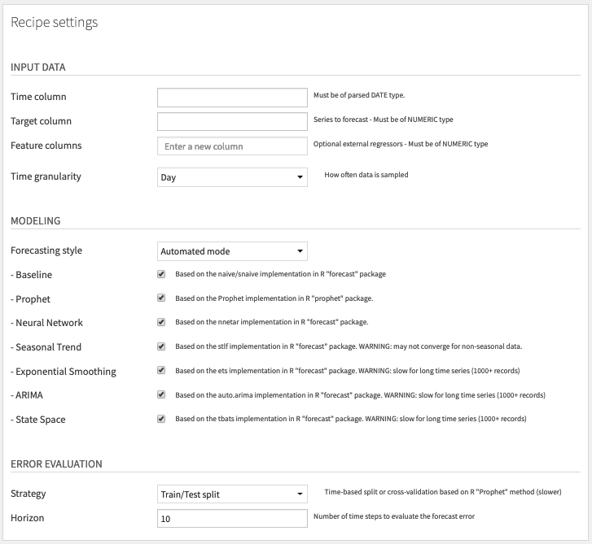

# Forecast Plugin

The Forecast plugin provides visual recipes in Dataiku DSS to work on time series data to solve forecasting problems.

>Forecasting is required in many situations: deciding whether to build another power generation plant in the next five years requires forecasts of future demand; scheduling staff in a call centre next week requires forecasts of call volumes; stocking an inventory requires forecasts of stock requirements. Forecasts can be required several years in advance (for the case of capital investments), or only a few minutes beforehand (for telecommunication routing). Whatever the circumstances or time horizons involved, forecasting is an important aid to effective and efficient planning.

 - Hyndman, Rob J. and George Athanasopoulos

## The Problem

Forecasting is a branch of Machine Learning where:
- The training data consists of one or multiple time series.
- The object to predict is the future values of one of these time series.

A time series is simply a variable with several values measured over time.

Forecasting is slightly different from "classic" Machine Learning (ML) as available currently in the Visual ML interface of Dataiku, because:
- Forecast models output multiple values whereas one Visual ML analysis is designed to predict a single output.
- Open source implementations of forecast models are different from the Python/Scala ones available in Visual ML.
- Evaluation of forecast accuracy uses specific methods (errors across a forecast horizon, cross-validation) which are not currently available in Visual ML.

Having said that, it has always been possible to forecast time series in Dataiku using Visual ML with custom work:
- Feature engineering to get lagged features for each time series, for instance using the Window recipe.
- If the forecast is for more than one time step ahead: training one Visual ML model for each forecast horizon.
- Custom code to evaluate the models accuracy and forecast future values for multiple steps.

Another way would be for a data scientist to code her own forecasting pipeline using open source R or Python libraries.

These two ways of building a forecasting pipeline require good knowledge of machine learning, forecasting techniques and programming. They are not accessible to a Data Analyst user. With this plugin, we want to offer a simple way to build a forecasting pipeline without code.

## Description

This plugin offers a set of 3 visual recipes to forecast yearly to hourly time series. It covers the full cycle of data cleaning, model training, evaluation and prediction.
- [Cleaning, aggregation, and resampling of time series data](#clean-recipe) (Recipe)
- [Training of forecast models of time series data, and evaluation of these models](#train-and-evaluate-recipe) (Recipe)
- [Predicting future values and get historical residuals based on trained models](#predict-recipe) (Recipe)

It follows classic forecasting methods described in:
- Hyndman, Rob J., and George Athanasopoulos. *[Forecasting: principles and practice](https://otexts.org/fpp2)*. OTexts, 2018.
- Taylor, Sean J., and Benjamin Letham. *[Forecasting at Scale](https://doi.org/10.1080/00031305.2017.1380080)*. The American Statistician, 2018.

This plugin does NOT work on narrow temporal dimensions (data must be at least at the hourly level) and does not provide signal processing techniques (Fourier Transform…).

This plugin works well when:
- The training data consists of one or multiple time series at the hour/day/week/month/quarter/year level and fits in the server’s RAM.
- The object to predict is the future of one of these time series.

## Installation Notes

The plugin can be installed from the Plugin Store in DSS "Administration > Plugins > Store". You can also check its development branch ["time-series-forecast"](https://github.com/dataiku/dataiku-contrib/tree/time-series-forecast/time-series-forecast) on the [dataiku-contrib](https://github.com/dataiku/dataiku-contrib) git repo.

Note that the plugin uses an R code environment so R must be installed and integrated with Dataiku on your machine (version 3.5.0 or above).

You may encounter issues with the installation of the RStan package in the code environment on some operating systems. RStan has some system-level dependencies (C++) that may require additional setup. In this case, please see the [RStan Getting Started](https://github.com/stan-dev/rstan/wiki/RStan-Getting-Started) wiki.

## Changelog

**Version 0.0.2 "alpha 2" (2019-03)**

* Multivariate Forecasting: Added support of external regressors for Neural Network, Prophet and ARIMA models (requires availability of future values of regressors when forecasting).

**Version 0.0.1 "alpha 1" (2019-01)**

* Initial release
* First pipeline for univariate forecasting of hourly to yearly time series

## Roadmap

- Evaluation recipe:
     * For cross-validation strategy: error metrics at each step within the horizon
- Prediction recipe:
     * Add ability to get multiple model forecasts at the same time for ensembling
     * Fan plot of confidence intervals within the horizon

## How To Use

### Clean recipe
**Use this recipe to aggregate, resample, and clean missing values and outliers from the time series.**

*Input:*
- Dataset containing time series.

*Output:*
- Dataset containing cleaned time series.

#### Settings

##### Input Data
- **Time column:** The column with time information in Dataiku date format (may need parsing beforehand in a Prepare recipe).
- **Series columns:** The columns with time series numeric values.

##### Resampling and Aggregation
- **Time granularity:** This determines the amount of time between data points in the cleaned dataset.
- **Aggregation method:** When multiple rows fall within the same time period, they are aggregated into the cleaned dataset either by summing (default) or averaging their values.

##### Missing Values
- **Imputation strategy**: Choose one of the following methods:
    - Interpolate (default) uses linear interpolation for non-seasonal series. For seasonal series, a robust STL decomposition is used. A linear interpolation is applied to the seasonally adjusted data, and then the seasonal component is added back.
    - Replace with average/median/fixed value.
    - Do nothing.

##### Outliers
- **Imputation strategy**: Choose one of the following methods:
    - Interpolate uses the same technique as for missing values.
    - Replace with average/median/fixed value.
    - Do nothing (default).

Outliers are detected by fitting a simple seasonal trend decomposition model using the [tsclean method](https://www.rdocumentation.org/packages/forecast/versions/8.4/topics/tsclean) from the forecast package.

### Train and Evaluate recipe
**Use this recipe to train forecasting models and evaluate them on cleaned historical data.**

*Input:*
- Dataset with time series data (ideally the output of the Clean recipe).

*Output:*
- Folder containing the forecast R objects.
- Dataset containing the evaluation results.

#### Settings

##### Input Data
- **Time column:** The column with time information in Dataiku date format
- **Target Series column:** The column with the time series you want to predict.
- **Feature columns (optional):** Columns with external numeric regressors, for instance indicators of holidays. Note that future values of these regressors are required when forecasting.

##### Modeling
- **Automated mode:** Select which models to train. By default we only try two model types: Baseline and Prophet, as they converged for all the datasets used in our benchmarks. You may select more models, but be aware that some model types take more time to compute, or may fail to converge on datasets. In the latter case, you will get an error when running the recipe, telling you which model type to deactivate. The following models are available in the recipe:
    - Baseline
    - Prophet *(can use external regressors)*
    - Neural Network *(can use external regressors)*
    - ARIMA *(can use external regressors)*
    - Seasonal Trend
    - Exponential Smoothing
    - State Space
- **Expert mode:** Gives access to advanced parameters that are custom to each model type. For details, see [forecast](https://cran.r-project.org/web/packages/forecast/forecast.pdf) and [prophet](https://facebook.github.io/prophet/docs/quick_start.html) R package documentation.

##### Error Evaluation
- **Train/Test Split (default):** Train/test split where the test set consists of the last *H* values of the time series. You can change *H* with the *Horizon* parameter. The models will be retrained on the train split and evaluated on their errors on the test split, for the entire forecast horizon.
- **Time Series Cross-validation:** Time series method to split your dataset into multiple rolling train/test splits. The models will be retrained and evaluated on their errors for each split. Error metrics are then averaged across all splits. Each split is defined by a cutoff date: the train split is all data before or at the cutoff date, and the test split is the *H* values after cutoff. *H* is the *Horizon* parameter, same as for the Train/Test Split strategy. Cutoffs are made at regular intervals according to the *Cutoff period* parameter, but cannot be before the *Initial training* parameter. Both parameters are expressed in number of time steps. Having a large enough initial training set guarantees that the models trained on the first splits have enough data to converge. You may want to increase that parameter if you encounter model convergence errors. The exact method used for cross-validation is described in the [Prophet documentation](https://facebook.github.io/prophet/docs/diagnostics.html) and explained in a [simpler version by Hyndman](https://robjhyndman.com/hyndsight/tscv).

Note that Cross-Validation takes more time to compute since it involves as multiple retraining and evaluation of models. In contrast, the Train/Test Split strategy only requires one retraining and evaluation. In order to alleviate that problem, we implemented retraining so that models are refit to each training split but hyperparameters are not re-estimated. This is done on purpose to accelerate computation.

### Predict recipe
**Use this recipe to predict future values or produce historic residuals using a previously trained model.**

*Input:*
- Folder containing the forecast R objects (from the Train and Evaluate recipe).
- Dataset containing the evaluation results (from the Train and Evaluate recipe).
- (Optional) Dataset containing the future values of the external regressors, if you have used the "Feature columns" parameter of the Train and Evaluate recipe.

*Output:*
- Dataset containing forecasts and/or historical residuals

#### Settings

##### Model selection
Choose how to select the model used for prediction:
- **Automatic mode:** If you want to select the best model according to one of the error metric computed in the evaluation dataset input.
- **Manual:** If you want to select a model yourself.

##### Prediction
Choose whether you want to include the history, the forecast, or both. If you are including the forecast, specify the *Horizon* and the probability percentage for the *Confidence interval*. If you are including the history, please note that residuals are equal to the historical value minus the one-step forecast.

The output dataset is a good candidate for the user to build charts to visually inspect the forecast results. Please see examples of such charts below:

## Advanced Usages

### Forecasts by Entity

If you want run the recipes to get multiple forecast models per entity (e.g. per product or store), you will need partitioning. That requires to have all datasets partitioned by 1 dimension for the category, using the [discrete dimension](https://doc.dataiku.com/dss/latest/partitions/identifiers.html#discrete-dimension-identifiers) feature in Dataiku. If the input data is not partitioned, you can use a Sync recipe to repartition it, as explained in [this article](https://www.dataiku.com/learn/guide/other/partitioning/partitioning-redispatch.html).

### Combination of Forecast and Machine Learning

A full pipeline would combine ML with forecast models. First, you can predict the forecast residuals (actual value - forecast) using ML models. ML is indeed most effective once the trend and seasonality have been removed, so the time series is stationary. Second, you can perform anomaly detection using clustering in the Visual ML, by detecting spikes in the forecast residuals.

# License

The Forecast plugin is:

   Copyright (c) 2019 Dataiku SAS
   Licensed under the [MIT License](LICENSE.md).
